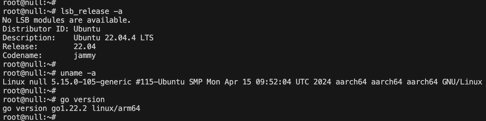
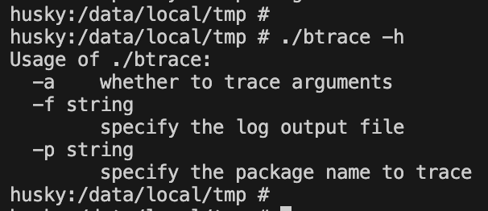
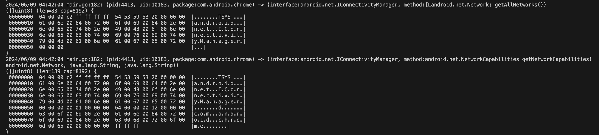

# btrace

## 简介

btrace：binder_transaction+eBPF+Golang实现通用的Android APP动态行为追踪工具。

方案说明：https://bbs.kanxue.com/thread-281895.htm

## 编译

ARM64的Linux环境中，需要先安装Golang开发环境，然后：

git clone https://github.com/null-luo/btrace.git

cd btrace

make

## 运行

真机或者ARM模拟器都可以：

adb push btrace /data/local/tmp

chmod +x btrace

./btrace

