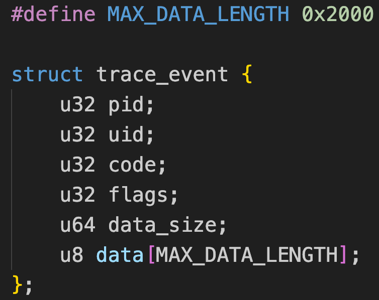
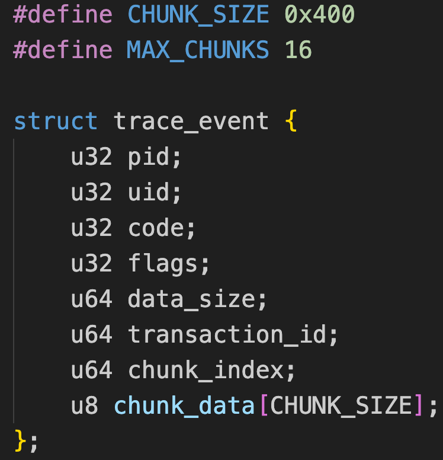

# BPF Ring Buffer Chunking

在我们的场景里，BPF程序需要将hook到的数据发送到用户空间，BPF perf buffer是一个选择，但它存在一些问题，例如浪费内存、事件顺序无法保证等，所以我们倾向于使用内核5.8引入的另一个新的BPF 数据结构：BPF ring buffer（环形缓冲区），它提供了一套新的reserve/commit API（先预留再提交），内存效率更高，且能保证事件顺序。

可是BPF ring buffer的reserve/commit API有一个限制：BPF 校验器在校验时必须知道预留数据的大小，因此不支持动态大小的事件数据。所以在btrace的v1.0.0版本里我们使用了固定大小的事件结构：

但这样既浪费空间（很多事件里的data远小于0x2000），又不能完整传递数据（有的事件里的data大于0x2000）。

在btrace的v1.1.0版本里，我们进行了改进，在ebpf程序里对大块的data进行分片处理，每个分片带上一个事件唯一标识transaction_id，然后通过BPF ring buffer传送到用户空间，用户空间根据transaction_id来汇聚和重组分片。

但是BPF verifier为了保证 BPF 程序的所有操作必须在有限时间（bounded time）内完成，所以不支持动态次数的循环（5.17内核已经支持 `bpf_loop()`特性，但是我手上的手机和PC都是5.15的内核），所以我们只能在程序里手动限定循环次数（MAX_CHUNKS）：

